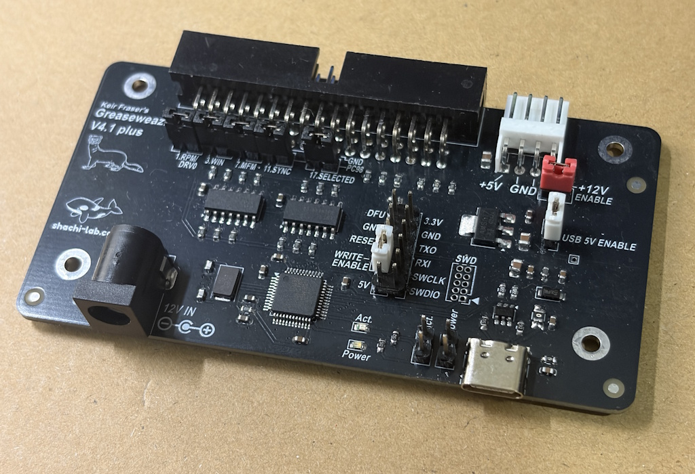
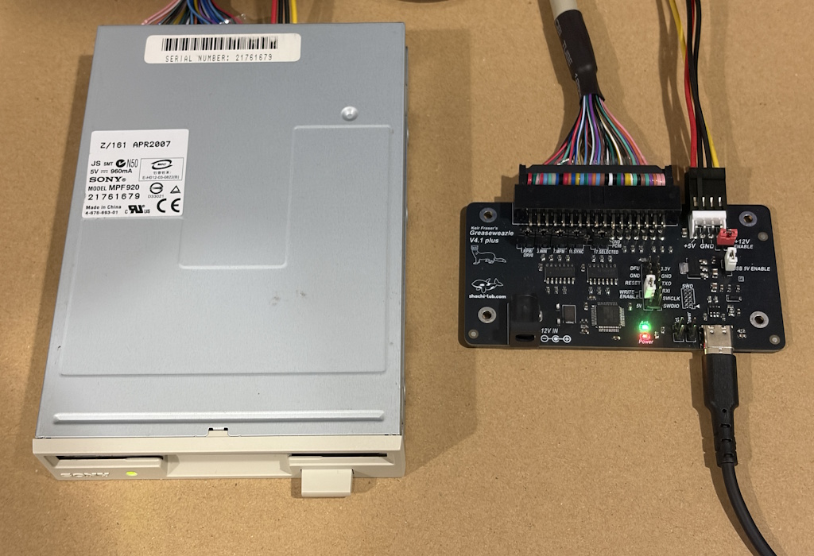

# Shachi-lab Greaseweazle V4.1 Plus Board

[🇯🇵 日本語版はこちら](README_ja.md)

This repository contains KiCad design data for a Greaseweazle V4.1 based compatible board created by Shachi-lab.

This board is based on Greaseweazle V4.1, with a few small modifications to make it easier to use with 5.25-inch FDDs and PC-98 style FDD setups.

For convenience, this board is referred to as **V4.1 Plus** in this repository.

**V4.1 Plus is not an official Greaseweazle product name.**

<a href="./images/gw-v41-plus_1.jpg">
</a>

---

## About Greaseweazle

Greaseweazle is an open-source USB floppy interface for reading and writing floppy disks using standard PC floppy disk drives.

Unlike ordinary USB floppy drives, Greaseweazle can access floppy disks at a lower level.  
It can capture and write magnetic flux transitions, which makes it useful for handling disk formats that are not supported by standard USB floppy drives.

For firmware, host tools, usage, and detailed documentation, please refer to the original Greaseweazle project.

* Original Greaseweazle project  
  https://github.com/keirf/greaseweazle

* Greaseweazle Wiki  
  https://github.com/keirf/greaseweazle/wiki

---

## About this repository

This repository provides only the KiCad design data for the Shachi-lab Greaseweazle compatible board.

Firmware, host tools, and usage instructions are not included in this repository.  
This board is a clone-based compatible board, so basic usage follows the original Greaseweazle documentation.

---

## KiCad version

This board design was created with **KiCad 10.0**.

Older versions of KiCad may not open the project correctly.

---

## Board overview

This board is based on Greaseweazle V4.1.

The circuit is close to the original Greaseweazle V4.1 design.  
The board outline, mounting holes, connectors, pin headers, and LED positions are kept as close as possible to the original V4.1 board.

Some parts were changed to make the board easier to hand-assemble and easier to use with 5.25-inch FDDs and PC-98 related FDD setups.

---

## Main differences from the original V4.1 board

* 2-layer PCB
  * The original Greaseweazle V4.1 board is a 4-layer PCB
* SMT parts are mainly 0603 / 1608 size
  * The original board uses 0402 parts
  * This change makes hand assembly easier
* Additional pin headers for PC-98 FDD use
  * These headers are intended for cutting or controlling specific signals
* Additional +12V output path for 5.25-inch FDDs
  * Allows +12V from a common AC adapter to be supplied to a Berg connector

---

## Current status

The board has been tested with a 3.5-inch FDD and a standard DOS/Windows 1.44MB floppy disk.

Confirmed so far:

* Greaseweazle Firmware 1.6 programming
* USB connection on Windows 11
* Recognition with `gw info`
* 3.5-inch FDD connection
* Reading a DOS/Windows 1.44MB floppy disk
* Creating an IMG file using the `ibm.1440` profile
* Opening the IMG file with 7-Zip

The FDD used for this test was `SONY MPF920`.

<a href="./images/gw-v41-plus_2.jpg">
</a>

---

## Not yet confirmed

The following items are still under test.

* Reading PC-98 5.25-inch floppy disks
* Stable operation with 5.25-inch FDDs
* 300rpm / 360rpm related behavior
* DENS signal behavior
* Compatibility with various FDD models

---

## Firmware and usage

Firmware, host tools, and usage follow the original Greaseweazle documentation.

This repository does not include Greaseweazle firmware or host tools.

For this board, the AT32F4 HEX file was used.

Example:

```text
greaseweazle-firmware-at32f4-1.6.hex
```

In my test environment, `gw info` showed the following result.

```text
Host Tools: 1.23
Device:
  Port:     COM7
  Model:    Greaseweazle V4.1
  MCU:      AT32F403A, 216MHz, 224kB SRAM
  Firmware: 1.6
  Serial:   GW053C11222847000007E0A413
  USB:      Full Speed (12 Mbit/s), 128kB Buffer
```

The `Greaseweazle V4.1` model name shown here is returned by the Greaseweazle firmware.  
It does not mean that this board is an official Greaseweazle V4.1 board.

---

## Notes

This is a self-made Greaseweazle compatible board created by Shachi-lab.  
It is not an official Greaseweazle product.

If you build this board, please check the KiCad design data and circuit carefully.  
Use it at your own risk.

Old floppy disks and FDDs may have various mechanical and media-related issues.  
Damaged or dirty floppy disks may cause unstable reading behavior or may contaminate the FDD head.

---

## Related article

A related article is available on the Shachi-lab blog.

* Greaseweazle互換基板を作る！ファームを書いて3.5インチFDを読んでみた  
  https://blog.shachi-lab.com/064_greaseweazle_firmware_fdd_read/

---

## License

This board is based on the original Greaseweazle project by Keir Fraser.

The KiCad design data in this repository is released with respect for the original Greaseweazle project and under the license terms of the original project.

Please refer to the original Greaseweazle repository for license details.

* https://github.com/keirf/greaseweazle
